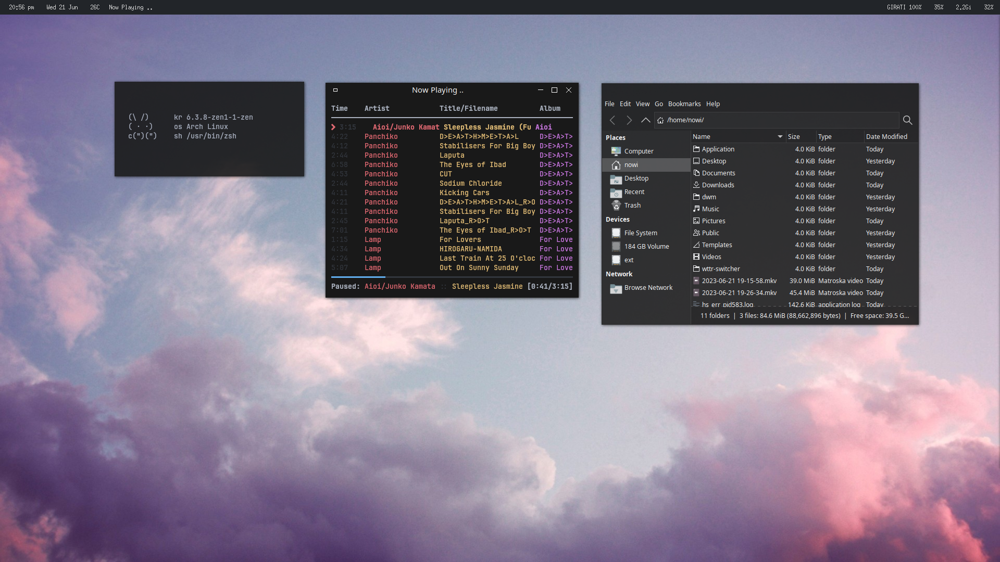
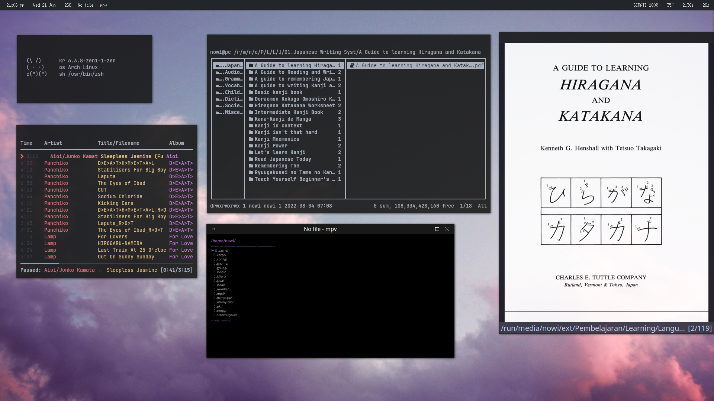

# dotfiles

openbox dotfiles
first time using github
sry lol

<h1>stolen form</h1>
<pre>archcraft / https://github.com/archcraft-os/archcraft-openbox
archlabs / https://github.com/ArchLabs/archlabs_repo
wildan-hyprland /https://github.com/wildan-pratama/wildan-hyprland
nuxshed / https://github.com/nuxshed/dotfiles
</pre>

